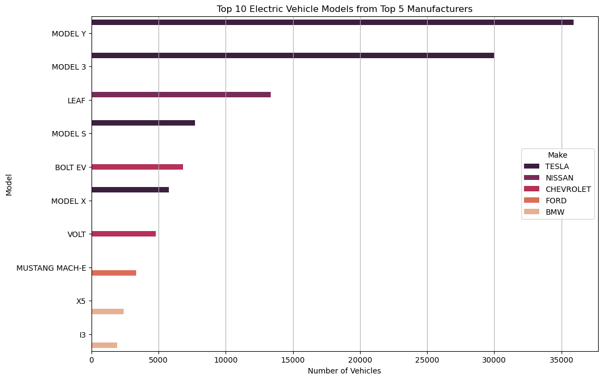
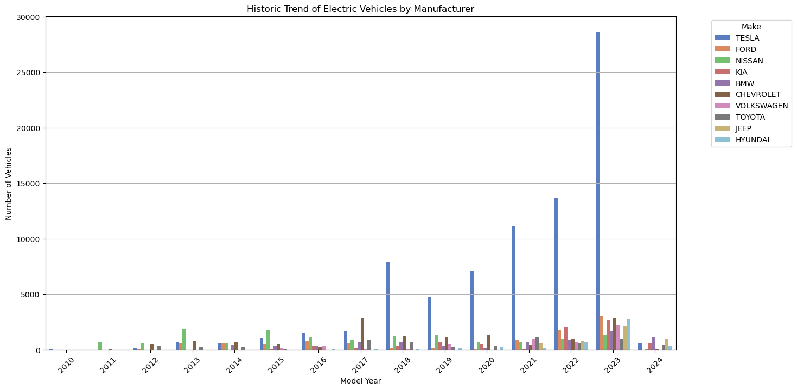

# Electric-Vehicle-Market-Size-Case-Study

## Background and Overview
Market Size Analysis is the process of estimating the potential sales for a product or service within a particular market segment. In the context of electric vehicles (EVs), it involves assessing the total volume of EV registrations to understand the growth of the market, forecast future trends, and help stakeholders make informed decisions regarding production, infrastructure development, and policy-making.

## Objectives
The primary objective of this analysis is to leverage historical EV registration data to understand the current market penetration of EVs, predict future market growth, and identify key trends and factors driving market expansion. The specific goals include:

- Assess the historical growth trend of EV registrations.
- Forecast future EV registrations based on historical trends.
- Analyze the distribution of EV registrations across different models, makes, and geographical regions.
- Estimate the market size and growth potential of the EV market for upcoming years.
- Provide insights to support stakeholders in decision-making processes related to production, infrastructure planning, and policy formulation.

## Tools & Technologies
- Python (Jupyter Notebook)
- Pandas, Matplotlib, Seaborn
- ARIMA (from statsmodels)

## Data Structure Overview

The dataset used for this case study was sourced from [Statso.io](https://statso.io/market-size-of-evs-case-study/). It contains market size data  from **1997 to 2024**, across different states in the US.

Each entry represents the estimated EV market size for that year and region, allowing for temporal and geographic comparisons.

## Executive Summary

The electric vehicle adoption landscape demonstrates exceptional growth momentum, with registration data revealing exponential expansion particularly accelerating from 2016 onwards. Our ARIMA forecasting model projects continued robust adoption growth beyond 2024, with the market experiencing a dramatic inflection point around 2017 that fundamentally transformed consumer acceptance patterns. Tesla's adoption leadership emerges as a defining characteristic, with Model Y and Model 3 capturing the highest registration volumes, while traditional manufacturers like Nissan maintain significant adoption through models like the Leaf. The analysis reveals that 2023 represents a peak registration year, suggesting EV adoption has entered mainstream consumer acceptance with sustained growth anticipated for the forecast period.

### Adoption, Evolution and Consumer Acceptance Patterns
The EV adoption curve reveals three distinct phases:
- Early Adoption Phase (1997-2015): Limited consumer acceptance with niche market penetration
- Acceleration Phase (2016-2020): Rapid adoption driven by technology improvements and policy support
- Mainstream Adoption Phase (2021-2024): Exponential growth with widespread consumer acceptance

### Model Preference and Consumer Choice Patterns

##### TESLA'S MODEL Y and MODEL 3 are the most popular models, followed by the NISSAN'S LEAF 
- TESLA’s MODEL Y and MODEL 3 are the most registered vehicles, with MODEL Y having the highest number of registrations.

- NISSAN’s LEAF is the third most registered model and the leading non-TESLA vehicle.

- TESLA’s MODEL S and MODEL X also have a significant number of registrations.

- CHEVROLET’s BOLT EV and VOLT are the next in the ranking with considerable registrations, followed by BOLT EUV.

- FORD'S MUSTANG MACH-E and BMW'S X5 and I3 have the lowest number of registrations among the models shown

### Manufacturer Adoption Leadership Dynamics
#### The manufacturer landscape reveals clear evolution in consumer preferences and adoption patterns:
Historical Adoption Leadership Transitions:

- 2011-2015: Nissan led early adoption with Leaf popularity
- 2017: Chevrolet briefly achieved peak registration volumes
- 2018-2024: Tesla established sustained adoption leadership

### Technology Performance Indicators
- Tesla Roadster: Premium segment leader at 234 miles average range
- Tesla Model S/X/3: Consistent top-tier performance
- Chevrolet Bolt EV: Strong competitive positioning among non-Tesla models

### Historical Trends Story

The EV adoption transformation represents one of the most significant consumer behavior shifts in automotive history. Beginning as a niche segment driven by environmental enthusiasts and early technology adopters, consumer acceptance evolved through technology improvements, expanded model availability, and supportive policy frameworks. Tesla's market entry fundamentally changed consumer perceptions, demonstrating that EVs could achieve performance parity while delivering superior technology integration. This catalyst effect triggered broader consumer acceptance, encouraging traditional manufacturers to accelerate EV model development and expand consumer choice options.

## Strategic Recommendations and Applications
### For Automotive Manufacturers
### Product Development Strategy:

- <b>Model Portfolio Expansion</b>: Focus on vehicle segments showing strong adoption growth patterns (SUVs, crossovers) based on Model Y and Model 3 popularity
- <b>Feature Prioritization</b>: Emphasize electric range capabilities (>150 miles) as this correlates with higher adoption rates in the dataset
- <b>Market Positioning</b>: Target underserved segments where traditional manufacturers can compete effectively against Tesla's current offerings:

### Production Planning: 
- <b>Capacity Scaling</b>: Align production capacity with ARIMA forecasts showing continued exponential adoption growth through 2027
- <b>Geographic Focus</b>: Prioritize manufacturing and distribution in states showing the highest registration growth rates
- <b>Timeline Strategy</b>: Accelerate time-to-market for new models to capture adoption momentum

The comprehensive nature of this adoption analysis positions stakeholders to make informed decisions about the rapidly evolving EV landscape, providing a competitive advantage through data-driven insights into consumer behavior and adoption patterns.

## Electric Vehicle Analysis Dashboard Using PowerBi 

### Preview 

The dashboard explores the Electric Vehicle adoption interactively using PowerBi as opposed to python libraries

## How to Use
- Clone the repository
- Open the .pbix file on Power Bi Desktop 
- Explore the dashboard report to gain insights on Electric Vehicle adoption over the years.

